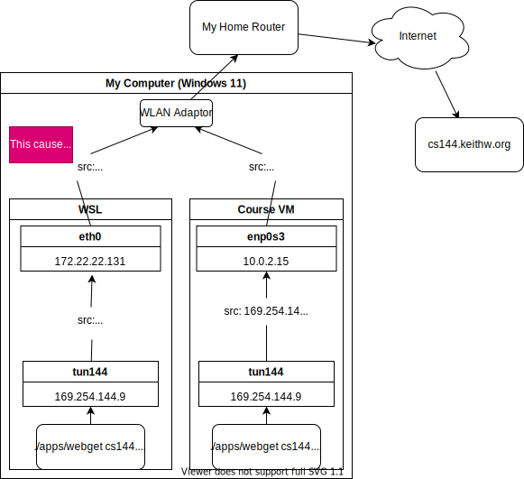
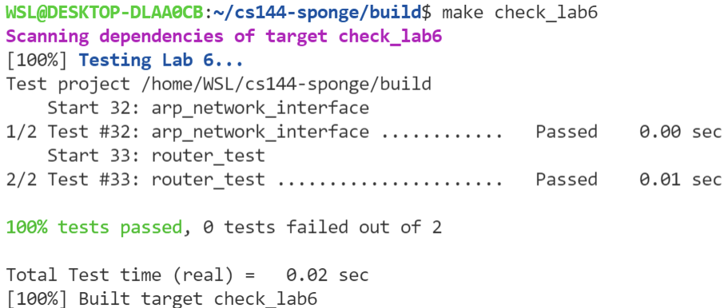

# FOREWORD

This is **my project** report for [Stanford CS144 - Computer Networks, 2021 Fall](https://cs144.github.io/). 

The original `README.md` can be found [here](https://github.com/cs144/sponge).

**PLEASE NOTE: The hyperlinks to my source code in this repo are INVALID!!! This is a public version of my project. I don't open my source code because it is a course project and I believe I'm obliged to help protect academic integrity.**

# Build Guide

**WARNING: If you are testing from a Linux distribution, you will probably face the problem that `webget` fails to work.** It is caused by several reasons, including:

1. `webget` failed to register a TUN/TAP device from the system;

2. The system's NIC failed to process the packets from the TUN/TAP device, illustrated by the following picture:

   

**I recommend you to use [the VM provided in the course website](https://stanford.edu/class/cs144/vm_howto/vm-howto-image.html) if you want to test my code.**

## Environment Set Up

### For Ubuntu or Debian

**You should set up work environment by:**

```bash
$ sudo apt-get -y install build-essential gcc gcc-8 g++ g++-8 cmake libpcap-dev htop jnettop screen   \
                   emacs-nox vim-nox automake pkg-config libtool libtool-bin git tig links     \
                   parallel iptables mahimahi mininet net-tools tcpdump wireshark telnet socat \
                   clang clang-format clang-tidy clang-tools coreutils bash doxygen graphviz   \
                   virtualbox-guest-utils netcat-openbsd
```

**MAKE SURE ALL PACKAGES ARE INSTALLED!!!**

Or you can run:

```bash
wget https://web.stanford.edu/class/cs144/vm_howto/setup_dev_env.sh
bash ./setup_dev_env.sh
```

instead.

### For other OS

Please refer to [the website](https://stanford.edu/class/cs144/vm_howto/).

## Steps

First, clone this repo by 

```bash
$ git clone https://github.com/endless-hu/cs144-sponge
```

In the repo, make a `build` directory:

```bash
$ mkdir build
$ cd build
```

Then compile it:

```bash
$ CC=clang CXX=clang++ cmake ..
```

<del>Ignore the Werror in the original project by</del>

```
$ export CXXFLAGS="-Wno-error"
```

<del>**note**: *If the above method fails, modify the file `etc/cflags.cmake:3`, delete something like `-Werror` to suppress Werror.*</del>

**Update:** *No need to ignore the `Werror` now, I deleted the `-Werror` flag in `etc/flags.cmake`.*

Finally make it by:

```bash
$ make -j 8
```

# Project Overview


## Lab 0 - Networking Warm up

The original requirement can be found in [`LabSpec/lab0.pdf`](./LabSpec/lab0.pdf).

### Tasks

To implement the following classes/functions:

- `get_URL(const string &host, const string &path)`: Connect to the computer whose name is `host` and request the URL path given in the `path` string. Print out everything the server sends back. The function is in [`apps/webget.cc`](./apps/webget.cc).
- `class ByteStream`: The class is like a pipeline - Bytes are written on the “input” side and can be read, in the same sequence, from the “output” side. Methods include `read`, `write`, `eof`, etc. Relevant files are [`libsponge/byte_stream.hh`](./libsponge/byte_stream.hh) and [`libsponge/byte_stream.cc`](./libsponge/byte_stream.cc)

### Test

Build the project first, then run:

```
$ make check_lab0
```

It will automatically test my code for lab 0.

**Assertion: I PASSED ALL TESTS IN LAB 0.**

## Lab 1 - Stitching Substrings into a Bytes Stream

The original requirement can be found in [`LabSpec/lab1.pdf`](./LabSpec/lab1.pdf).

### Tasks

To implement a class `StreamReassembler` so that it can handle substrings which come in any order. For example, the whole string is `abcde\0`(`\0` means `EOF`), substring may come in as:

```
ab, 0
a, 0
e, 4
d, 3
cde\0, 2
```

The trailing integer indicates the position of the substring's first byte in the whole byte stream.

The `StreamReassembler` will push the incoming substring to the `bytestream` in their initial order. When a later substring comes, it should hold the substring to wait until the previous bytes are all written into `bytestream`. 

### Relevant Files

- [`libsponge/stream_reassembler.hh`](./libsponge/stream_reassembler.hh)
- [`libsponge/stream_reassembler.cc`](libsponge/stream_reassembler.cc)

### Test

Build the project first, then run:

```
$ make check_lab1
```

It will automatically test my code for lab 1.

**Assertion: I PASSED ALL TESTS IN LAB 1.**

Detailed report can be found in [`writeups/lab1.md`](./writeups/lab1.md).

## Lab 2 - the TCP Receiver

The original requirement can be found in [`LabSpec/lab2.pdf`](./LabSpec/lab2.pdf).

### Tasks

#### Wrap/Unwrap

To implement functions `wrap()` and `unwrap()` to switch a sequence number between `uint64_t` and `uint32_t`. 

```c++
//! Transform a 64-bit absolute sequence number (zero-indexed) into a 32-bit relative sequence number
//! \param n the absolute sequence number
//! \param isn the initial sequence number
//! \returns the relative sequence number
WrappingInt32 wrap(uint64_t n, WrappingInt32 isn);

//! Transform a 32-bit relative sequence number into a 64-bit absolute sequence number (zero-indexed)
//! \param n The relative sequence number
//! \param isn The initial sequence number
//! \param checkpoint A recent absolute sequence number
//! \returns the absolute sequence number that wraps to `n` and is closest to `checkpoint`
uint64_t unwrap(WrappingInt32 n, WrappingInt32 isn, uint64_t checkpoint);
```

#### `TCPReceiver`

The "receiver" part of a TCP implementation.

It receives and reassembles segments into a `ByteStream`, and computes the acknowledgment number and window size to advertise back to the remote `TCPSender`.

### Relevant Files

- [`libsponge/wrapping_integers.hh`](./libsponge/wrapping_integers.hh)
- [`libsponge/wrapping_integers.cc`](./libsponge/wrapping_integers.cc)
- [`libsponge/tcp_receiver.hh`](./libsponge/tcp_receiver.hh)
- [`libsponge/tcp_receiver.cc`](./libsponge/tcp_receiver.cc)

### Test

Build the project first, then run:

```
$ make check_lab2
```

It will automatically test my code for lab 2.

**Assertion: I PASSED ALL TESTS IN LAB 2.**

Detailed report can be found in [`writeups/lab2.md`](./writeups/lab2.md).

## Lab 3 - The TCP Sender

The original requirement can be found in [`LabSpec/lab3.pdf`](./LabSpec/lab3.pdf).

### Tasks

To implement the class `TCPSender` so that it can support the following function:

- `fill_window()`: Send segments to fill the receiver's window. Note that at the beginning it assumes the window size is 1. And it should send  one more byte even when window size is 0.
- `ack_received()`: The sender received acknowledgement from the receiver, so it should delete the tracked segment which is acknowledged by the receiver. 
- `tick()`: The sender is told how many ticks have passed and it should determine whether the earliest outstanding segment should be resent. 
- `send_empty_segment()`: Used to send acknowledge segment to sender. 

### Relevant Files

- [`libsponge/tcp_sender.hh`](./libsponge/tcp_sender.hh)
- [`libsponge/tcp_sender.cc`](./libsponge/tcp_sender.cc)

### Test

Build the project first, then run:

```
$ make check_lab3
```

It will automatically test my code for lab 3.

**Assertion: I PASSED ALL TESTS IN LAB 3.**

Detailed report can be found in [`writeups/lab3.md`](./writeups/lab3.md).

## Lab 4 - The TCP Connection

The original requirement can be found in [`LabSpec/lab4.pdf`](./LabSpec/lab4.pdf).

### Tasks

To implement the class `TCPConnection` so that it can support the following function:

- `void connect()`: Initiate a connection by sending a SYN segment.
- `size_t write(const std::string &data)`: Write data to the outbound byte stream, and send it over TCP if possible. Returns the number of bytes from `data` that were actually written.
- `void end_input_stream()`: Shut down the outbound byte stream (still allows reading incoming data.
- `void segment_received(const TCPSegment &seg)`: Called when a new segment has been received from the network.
- `void tick(const size_t ms_since_last_tick)`: Called periodically by the OS when time elapses.

### Relevant Files

- [`libsponge/tcp_connection.hh`](./libsponge/tcp_connection.hh)
- [`libsponge/tcp_connection.cc`](./libsponge/tcp_connection.cc)

### Test

Build the project first, then run:

```
$ make check_lab4
```

It will automatically test my code for lab 4.

**NOTE: `webget` test ONLY SUCCEED in  [the VM provided in the course website](https://stanford.edu/class/cs144/vm_howto/vm-howto-image.html) .**

**I do not guarantee its success in WSL!!!**

If you have questions, please refer to the detailed report in [`writeups/lab4.md`](./writeups/lab4.md).


### Benchmark

#### In WSL

##### Optimized - `ByteStream` Uses `BufferList`


##### Unoptimized - `ByteStream` Uses `std::deque<char>`


#### In the VM provided in the course website

##### Unoptimized - `ByteStream` Uses `std::deque<char>`


## Lab 5 - The Network Interface

The original requirement can be found in [`LabSpec/lab5.pdf`](./LabSpec/lab5.pdf).

### Tasks

Implement a network interface, which supports:

1. Convert the IPv4 datagrams to Ethernet frames and send these frames to the next hop using the next hop's Ethernet address;
2. If the next hop's Ethernet address is unknown, resolve it by broadcasting ARP request. Ensure that only broadcast every 5 seconds for the same IP address to avoid messing the Ethernet;
3. Listening the Ethernet, every time it received a Ethernet frame:
   1. If the frame aims at the interface, conveying an IPv4 datagram, then send the IPv4 datagram up to TCP/IP;
   2. If the frame is an ARP message, learn the mapping from the sender's IP address to the sender's Ethernet address, then:
      1. If It's an ARP request message and it aims at the interface, send an ARP reply message back to the sender;
      2. If it's an ARP reply message, learn the mapping in the `target` fields.
4. The mappings are only kept for 30 seconds.

### Relevant Files

- [`libsponge/network_interface.hh`](./libsponge/network_interface.hh)
- [`libsponge/network_interface.cc`](libsponge/network_interface.cc)

### Test

Build the project first, then run:

```
$ make check_lab5
```

It will automatically test my code for lab 5.

**NOTE: `webget` test ONLY SUCCEED in [the VM provided in the course website](https://stanford.edu/class/cs144/vm_howto/vm-howto-image.html) .**

**I do not guarantee its success in WSL!!!**

The detailed report is in [`writeups/lab5.md`](./writeups/lab5.md).


## Lab 6 - IP Router

The original requirement can be found in [`LabSpec/lab6.pdf`](./LabSpec/lab6.pdf).

### Tasks

1. Implement the `void add_rule()` method to add routing rules in the `class Router`;
2. Implement the `void route_one_datagram(InternetDatagram &dgram)` method to forward the datagram to the longest-prefix-matching route and decrease its TTL. Drop it if no match is found or its TTL reaches 0.

### Relevant Files

- [`libsponge/router.hh`](./libsponge/router.hh)
- [`libsponge/router.cc`](libsponge/router.cc)

### Test

Build the project first, then run:

```
$ make check_lab6
```

It will automatically test my code for lab 6.



The detailed report is in [`writeups/lab6.md`](./writeups/lab6.md).

### Update On Jan. 19, 2022

**The code is FULLY OPTIMIZED now by using the data structure "_Radix Tree_".**

If we assume the *length of prefix* is **M**, and there are **N** *routing rules*, then the **time complexity** is **O(M)**, while the **space complexity** is **O(N)**.

Here is a table of complexities of different algorithms:

| Algorithm   | Time Complexity | Space Complexity |
| ----------- | --------------- | ---------------- |
| Brute-Force | O(MN)           | O(MN)            |
| Trie        | O(M)            | O(MN)            |
| Radix Tree  | O(M)            | O(N)             |


### <del>Further Improvement</del>

<del>**Update on January 18, 2022:** I implemented the Trie version of the lab, so the time complexity is O(m) now. **Besides, it's memory safe.** *(`m` still stands for the #length-of prefix, which is a constant because it never exceeds 32.)*</del>

<del>My implementation of the longest-prefix-matching is brute-force, whose time complexity is `O(mn)`, where `m` stands for #prefix-length, `n` stands for #number-of-rules.</del>

<del>Its performance can be improved by using the data structure **Trie** to O(m), where `m` stands for #prefix-length (Here `m` is a constant, because IPv4 address is 32-bit long).</del>

<del>I haven't optimized that because of my tight schedule. Maybe future :)</del>

## Lab 7

It's a non-coding lab. 

Generally it requires students to use their own implementation of the previous labs to communicate with each other. 

I tested it and it realized bidirectional stream copy. But due to my networks, later it failed. 
