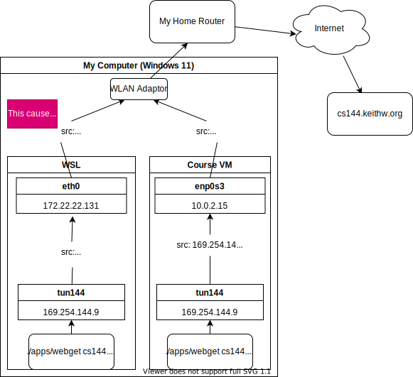
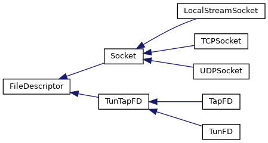

# Lab 4 Writeup

My name: Zhijing Hu

<del>My SUNet ID: [your sunetid here]</del>

<del>I collaborated with: [list sunetids here]</del>

<del>I would like to thank/reward these classmates for their help: [list sunetids here]</del>

This lab took me about 9 hours to do. <del>I [did/did not] attend the lab session.</del>


-----------------------------------------------------------

## UPDATE ON January 16, 2022

### 1. Bug Fixed In My `tcp_connection` Implementation.

#### Error code

It is caused by the incorrect remaining out bound capacity returned by `tcp_connection`:

##### CORRECT VER:

```c++
size_t TCPConnection::remaining_outbound_capacity() const { return _sender.stream_in().remaining_capacity(); }
```

##### INCORRECT VER:

```c++
size_t TCPConnection::remaining_outbound_capacity() const { return _sender.stream_in().size(); }  // initially it's ZERO
```

#### Analysis

When a `tcp_connection` is constructed, it did not have bytes in its `_sender`. So in the **FAULTING** code, it will return 0;

However, the `EventLoop` in `TCPSpongeSocket` will check whether the `tcp_connection` could receive more bytes by inspecting `TCPConnection::remaining_outbound_capacity()`. If it returns zero, the `EventLoop` will **NOT** `interest()` in poll-writing to the `tcp_connection`. 

Therefore, the faulting code will not transmit any contents read from `stdin` to `datagram adaptor`.

### 2. Explanation On The Failed `webget` Test In WSL

#### Configurations

##### Course VM

```
cs144@cs144vm:~$ ifconfig
enp0s3: flags=4163<UP,BROADCAST,RUNNING,MULTICAST>  mtu 1500
        inet 10.0.2.15  netmask 255.255.255.0  broadcast 10.0.2.255
        inet6 fe80::a00:27ff:feab:9f4a  prefixlen 64  scopeid 0x20<link>
        ether 08:00:27:ab:9f:4a  txqueuelen 1000  (Ethernet)
...

tun144: flags=4241<UP,POINTOPOINT,NOARP,MULTICAST>  mtu 1500
        inet 169.254.144.1  netmask 255.255.255.0  destination 169.254.144.1
        inet6 fe80::321a:c8f4:693c:93e8  prefixlen 64  scopeid 0x20<link>
...

tun145: flags=4241<UP,POINTOPOINT,NOARP,MULTICAST>  mtu 1500
        inet 169.254.145.1  netmask 255.255.255.0  destination 169.254.145.1

...

```

##### WSL - Ubuntu

```
WSL@DESKTOP-DLAA0CB:~/cs144-sponge/build$ ifconfig
eth0: flags=4163<UP,BROADCAST,RUNNING,MULTICAST>  mtu 1500
        inet 172.22.22.131  netmask 255.255.240.0  broadcast 172.22.31.255
        inet6 fe80::215:5dff:fe2d:b8bb  prefixlen 64  scopeid 0x20<link>
        ether 00:15:5d:2d:b8:bb  txqueuelen 1000  (Ethernet)
...

tun144: flags=4241<UP,POINTOPOINT,NOARP,MULTICAST>  mtu 1500
        inet 169.254.144.1  netmask 255.255.255.0  destination 169.254.144.1
        inet6 fe80::bcb4:1a0b:e962:59c3  prefixlen 64  scopeid 0x20<link>
        unspec 00-00-00-00-00-00-00-00-00-00-00-00-00-00-00-00  txqueuelen 500 
...

tun145: flags=4241<UP,POINTOPOINT,NOARP,MULTICAST>  mtu 1500
        inet 169.254.145.1  netmask 255.255.255.0  destination 169.254.145.1
        inet6 fe80::afa7:113:94ab:7cef  prefixlen 64  scopeid 0x20<link>
        unspec 00-00-00-00-00-00-00-00-00-00-00-00-00-00-00-00  txqueuelen 500  
...
```


#### `tshark` Captures

When I run the command

```
(${project_directory}/build)$ ./apps/webget cs144.keithw.org /hasher/xyzzy
```

in both course VM and WSL, the `tshark` capture results are:

##### Course VM

```
cs144@cs144vm:~/cs144-sponge$ sudo tshark -f 'host 104.196.238.229'
Running as user "root" and group "root". This could be dangerous.
Capturing on 'enp0s3'
    1 0.000000000    10.0.2.15 → 104.196.238.229 TCP 54 41333 → 80 [SYN] Seq=0 Win=64000 Len=0
    2 0.102344775    10.0.2.15 → 104.196.238.229 TCP 54 [TCP Retransmission] 41333 → 80 [SYN] Seq=0 Win=64000 Len=0
    3 0.308707387 104.196.238.229 → 10.0.2.15    TCP 60 80 → 41333 [SYN, ACK] Seq=0 Ack=1 Win=65535 Len=0 MSS=1460
    4 0.312601582    10.0.2.15 → 104.196.238.229 TCP 54 41333 → 80 [ACK] Seq=1 Ack=1 Win=64000 Len=0
    5 0.312718811    10.0.2.15 → 104.196.238.229 HTTP 127 GET /hasher/xyzzy HTTP/1.1
    6 0.313004812 104.196.238.229 → 10.0.2.15    TCP 60 80 → 41333 [ACK] Seq=1 Ack=74 Win=65535 Len=0
    7 0.645499137 104.196.238.229 → 10.0.2.15    HTTP 235 HTTP/1.1 200 OK  (text/plain)
    8 0.646866952    10.0.2.15 → 104.196.238.229 TCP 54 41333 → 80 [ACK] Seq=74 Ack=182 Win=63819 Len=0
    9 0.715023005 104.196.238.229 → 10.0.2.15    TCP 60 80 → 41333 [FIN, ACK] Seq=182 Ack=74 Win=65535 Len=0
   10 0.715547615    10.0.2.15 → 104.196.238.229 TCP 54 41333 → 80 [ACK] Seq=74 Ack=183 Win=64000 Len=0
   11 0.716246358    10.0.2.15 → 104.196.238.229 TCP 54 41333 → 80 [FIN, ACK] Seq=74 Ack=183 Win=64000 Len=0
   12 0.716496812 104.196.238.229 → 10.0.2.15    TCP 60 80 → 41333 [ACK] Seq=183 Ack=75 Win=65535 Len=0
^C12 packets captured

```

##### WSL - Ubuntu

```
WSL@DESKTOP-DLAA0CB:~$ sudo tshark -f 'host 104.196.238.229'
[sudo] password for WSL:
Running as user "root" and group "root". This could be dangerous.
Capturing on 'eth0'
    1 0.000000000 169.254.144.9 → 104.196.238.229 TCP 54 7924 → 80 [SYN] Seq=0 Win=64000 Len=0
    2 0.102652501 169.254.144.9 → 104.196.238.229 TCP 54 [TCP Retransmission] 7924 → 80 [SYN] Seq=0 Win=64000 Len=0
    3 0.308028395 169.254.144.9 → 104.196.238.229 TCP 54 [TCP Retransmission] 7924 → 80 [SYN] Seq=0 Win=64000 Len=0
    4 0.708188672 169.254.144.9 → 104.196.238.229 TCP 54 [TCP Retransmission] 7924 → 80 [SYN] Seq=0 Win=64000 Len=0
    5 1.508643222 169.254.144.9 → 104.196.238.229 TCP 54 [TCP Retransmission] 7924 → 80 [SYN] Seq=0 Win=64000 Len=0
    6 3.112004813 169.254.144.9 → 104.196.238.229 TCP 54 [TCP Retransmission] 7924 → 80 [SYN] Seq=0 Win=64000 Len=0
    7 6.314154246 169.254.144.9 → 104.196.238.229 TCP 54 [TCP Retransmission] 7924 → 80 [SYN] Seq=0 Win=64000 Len=0
^C7 packets captured
```

#### Analysis

The main difference is the **source IP address**. 

In the **course VM**, the source IP address is the `enp0s3` itself (aka. `10.0.2.15`);

But in **WSL**, the source IP address is `tun144` (aka. `169.254.144.9`).

The following picture shows the error.



Because the incorrect source IP address in WSL, the TCP package returned by the web server will not reach the `tun144` in my WSL.

#### Possible Solution

Configure the `NetworkManager` to handle these cases. 

I have no time to do this.


------------------------------------------


## Program Structure and Design of the `TCPConnection`:

### Useful Private Members and Helper Functions

- `bool _linger_after_streams_finish`: It indicates that whether the connection should stay alive for a while after its `FIN` is acknowledged. 

- `bool _rst_recvd`: used to indicate whether it received a `RST` segment to simplify `bool active()`. 

- `size_t _time_since_last_seg_rcvd`: Record the time since last segment received. Reset to 0 when `segment_received()` method is called. 

### Methods

Methods are relatively simple, see the code: 

- [`libsponge/tcp_connection.hh`](../libsponge/tcp_connection.hh)
- [`libsponge/tcp_connection.cc`](../libsponge/tcp_connection.cc)


------------------------------------------------


## [FIXED] Remaining Bugs: 

### NO NEED TO READ THE FOLLOWING WORDS! ! !

### SEE MY EXPLANATION [ABOVE](#1.-Bug-Fixed-In-My-`tcp_connection`-Implementation.)


I passed all the local tests, but my `TCPConnection` did not work with `TCPSpongeSocket`, so I spent one day to trace the code in `./apps/bidirectional_stream_copy` and `./libsponge/util/eventloop`. 

**I got some vague ideas about why it did not work, but since the code in these files totally exceed my ability, I'm unable to find bugs and fix them. I write the section to record what I've discovered and move on. **

### The Structure of `tcp_udp.cc`

#### The Top Level: `int main()`

It does these things:

```c++
//handle configuration and UDP setup from cmdline arguments
//build a TCP FSM on top of the UDP socket
        UDPSocket udp_sock;
        if (listen) {
            udp_sock.bind(c_filt.source);
        }
        LossyTCPOverUDPSpongeSocket tcp_socket(LossyTCPOverUDPSocketAdapter(TCPOverUDPSocketAdapter(move(udp_sock))));
        if (listen) {
            tcp_socket.listen_and_accept(c_fsm, c_filt);
        } else {
            tcp_socket.connect(c_fsm, c_filt);
        }

        bidirectional_stream_copy(tcp_socket);
        tcp_socket.wait_until_closed();
```

It sets up the socket and call `bidirectional_stream_copy(tcp_socket)`, in which there is an infinite loop, `EventLoop`. 

#### The Secondary Level: `bidirectional_stream_copy(Socket &socket)`

The intention of this function is to copy every thing from the `stdin` to the `socket`, assuming that the `socket` will parcel the string into segments and send the segments out. 

The basic structure is *(See __the comments__ and you'll know generally how it works)*:

```c++
    EventLoop _eventloop{};
    FileDescriptor _input{STDIN_FILENO};
    FileDescriptor _output{STDOUT_FILENO};
    ByteStream _outbound{buffer_size};
    ByteStream _inbound{buffer_size};

    // rule 1: read from stdin into outbound byte stream
    _eventloop.add_rule(
        _input,
        Direction::In,
        [&] { _outbound.write(_input.read(_outbound.remaining_capacity()));
            if (_input.eof()) {
                _outbound.end_input();
            }
            cout << "write \"" << _outbound.peek_output(20) << "\" to _outbound" << endl;
        }, ...);

    // rule 2: read from outbound byte stream into socket
    _eventloop.add_rule(
        socket,
        Direction::Out,
        [&] {
            const size_t bytes_to_write = min(max_copy_length, _outbound.buffer_size());
            cout << "writing \"" << _outbound.peek_output(bytes_to_write) << "\" to socket" << endl;
            const size_t bytes_written = socket.write(_outbound.peek_output(bytes_to_write), false);
            _outbound.pop_output(bytes_written);
            if (_outbound.eof()) {
                socket.shutdown(SHUT_WR);
                _outbound_shutdown = true;
            }
        },...);

    // rule 3: read from socket into inbound byte stream
    _eventloop.add_rule(
        socket,
        Direction::In,
        [&] {
            _inbound.write(socket.read(_inbound.remaining_capacity()));
            if (socket.eof()) {
                _inbound.end_input();
            }
        }, ...);

    // rule 4: read from inbound byte stream into stdout
    _eventloop.add_rule(
        _output,
        Direction::Out,
        [&] {
            const size_t bytes_to_write = min(max_copy_length, _inbound.buffer_size());
            const size_t bytes_written = _output.write(_inbound.peek_output(bytes_to_write), false);
            _inbound.pop_output(bytes_written);

            if (_inbound.eof()) {
                _output.close();
                _inbound_shutdown = true;
            }
        }, ...);

    // loop until completion
    while (true) {
        if (EventLoop::Result::Exit == _eventloop.wait_next_event(-1)) {
            return;
        }
    }
```

I added some `cout` statements in the lambda expression so that it will show when these functions are called. *(Actually I added even more `cout` both in it and in `EventLoop` to know how it works)* 


#### The Secondary Level: `class TCPSpongeSocket`

##### Overview

This class involves the simultaneous operation of two threads.

One, the "owner" or foreground thread, interacts with this class in much the same way as one would interact with a `TCPSocket`: it connects or listens, writes to and reads from a reliable data stream, etc. Only the owner thread calls public methods of this class.

The other, the "TCPConnection" thread, takes care of the back-end tasks that the kernel would perform for a `TCPSocket`: reading and parsing datagrams from the wire, filtering out segments unrelated to the connection, etc.

##### Working Procedure

The socket works in either ==server mode== (`listen_and_accept()`) or ==client mode== (`connect()`). In both modes, it initializes the private `TCPConnection` by calling `_initialize_tcp(TCPConfig)`, in which the private `TCPConnection` is constructed and the private `_eventloop` is configured.

The configuration of `_eventloop` is described in the comment:

```c++
// There are four possible events to handle:

// 1) Incoming datagram received (needs to be given to TCPConnection::segment_received method)

// 2) Outbound bytes received from local application via a write() call (needs to be read from the local stream socket and given to TCPConnection::data_written method)

// 3) Incoming bytes reassembled by the TCPConnection (needs to be read from the inbound_stream and written to the local stream socket back to the application)

// 4) Outbound segment generated by TCP (needs to be given to underlying datagram socket)

// rule 1: read from filtered packet stream and dump into TCPConnection
    _eventloop.add_rule(
        _datagram_adapter,
        Direction::In,
        [&] {
            auto seg = _datagram_adapter.read();
            if (seg) {
                _tcp->segment_received(move(seg.value()));
            }

            // debugging output:
            if (_thread_data.eof() and _tcp.value().bytes_in_flight() == 0 and not _fully_acked) {
                cerr << "DEBUG: Outbound stream to " << _datagram_adapter.config().destination.to_string()
                     << " has been fully acknowledged.\n";
                _fully_acked = true;
            }
        },
        [&] { return _tcp->active(); });

    // rule 2: read from pipe into outbound buffer
    _eventloop.add_rule(
        _thread_data,  // LocalStreamSocket _thread_data;
        Direction::In,
        [&] {
            const auto data = _thread_data.read(_tcp->remaining_outbound_capacity());
            cout << "TCPSpongeSocket, rule 2, reading data from socket: " << data << endl;
            const auto len = data.size();
            const auto amount_written = _tcp->write(move(data));
            if (amount_written != len) {
                throw runtime_error("TCPConnection::write() accepted less than advertised length");
            }

            if (_thread_data.eof()) {
                _tcp->end_input_stream();
                _outbound_shutdown = true;

                // debugging output:
                cerr << "DEBUG: Outbound stream to " << _datagram_adapter.config().destination.to_string()
                     << " finished (" << _tcp.value().bytes_in_flight() << " byte"
                     << (_tcp.value().bytes_in_flight() == 1 ? "" : "s") << " still in flight).\n";
            }
        },
        [&] { return (_tcp->active()) and (not _outbound_shutdown) and (_tcp->remaining_outbound_capacity() > 0); },
        [&] {
            _tcp->end_input_stream();
            _outbound_shutdown = true;
        });

    // rule 3: read from inbound buffer into pipe
    _eventloop.add_rule(
        _thread_data,
        Direction::Out,
        [&] {
            ByteStream &inbound = _tcp->inbound_stream();
            // Write from the inbound_stream into
            // the pipe, handling the possibility of a partial
            // write (i.e., only pop what was actually written).
            const size_t amount_to_write = min(size_t(65536), inbound.buffer_size());
            const std::string buffer = inbound.peek_output(amount_to_write);
            const auto bytes_written = _thread_data.write(move(buffer), false);
            inbound.pop_output(bytes_written);

            if (inbound.eof() or inbound.error()) {
                _thread_data.shutdown(SHUT_WR);
                _inbound_shutdown = true;

                // debugging output:
                cerr << "DEBUG: Inbound stream from " << _datagram_adapter.config().destination.to_string()
                     << " finished " << (inbound.error() ? "with an error/reset.\n" : "cleanly.\n");
                if (_tcp.value().state() == TCPState::State::TIME_WAIT) {
                    cerr << "DEBUG: Waiting for lingering segments (e.g. retransmissions of FIN) from peer...\n";
                }
            }
        },
        [&] {
            return (not _tcp->inbound_stream().buffer_empty()) or
                   ((_tcp->inbound_stream().eof() or _tcp->inbound_stream().error()) and not _inbound_shutdown);
        });

    // rule 4: read outbound segments from TCPConnection and send as datagrams
    _eventloop.add_rule(
        _datagram_adapter,
        Direction::Out,
        [&] {
            cout << "TCPSpongeSocket, rule 4: sending segments to _datagram_adapter" << endl;
            int cnt = 0;
            while (not _tcp->segments_out().empty()) {
                cnt++;
                _datagram_adapter.write(_tcp->segments_out().front());
                _tcp->segments_out().pop();
            }
            cout << "TCPSpongeSocket, rule 4, " << cnt << " segments sent" << endl;
        },
        [&] { return not _tcp->segments_out().empty(); });
```

After the private `TCPConnection` is constructed and the private `_eventloop` is configured, it will create a thread for the `TCPConnection` to work in the background. The thread executes the private function `_tcp_main()`, in which there's an infinite `_tcp_loop()`.

```c++
void TCPSpongeSocket<AdaptT>::_tcp_loop(const function<bool()> &condition) {
    auto base_time = timestamp_ms();
    while (condition()) {
        auto ret = _eventloop.wait_next_event(TCP_TICK_MS);
        if (ret == EventLoop::Result::Exit or _abort) {
            break;  // stop the loop if EventLoop wants to exit or abort
        }

        if (_tcp.value().active()) {
            const auto next_time = timestamp_ms();
            _tcp.value().tick(next_time - base_time);
            _datagram_adapter.tick(next_time - base_time);
            base_time = next_time;
        }
    }
}
```


#### The Third Level: `class EventLoop`

##### Private Members

```c++
    using CallbackT = std::function<void(void)>;  //!< Callback for ready Rule::fd
    using InterestT = std::function<bool(void)>;  //!< `true` return indicates Rule::fd should be polled.

    //! \brief Specifies a condition and callback that an EventLoop should handle.
    //! \details Created by calling EventLoop::add_rule() or EventLoop::add_cancelable_rule().
    class Rule {
      public:
        FileDescriptor fd;    //!< FileDescriptor to monitor for activity.
        Direction direction;  //!< Direction::In for reading from fd, Direction::Out for writing to fd.
        CallbackT callback;   //!< A callback that reads or writes fd.
        InterestT interest;   //!< A callback that returns `true` whenever fd should be polled.
        CallbackT cancel;     //!< A callback that is called when the rule is cancelled (e.g. on hangup)

        //! Returns the number of times fd has been read or written, depending on the value of Rule::direction.
        //! \details This function is used internally by EventLoop; you will not need to call it
        unsigned int service_count() const;
    };

    std::list<Rule> _rules{};  //!< All rules that have been added and not canceled.
```

##### Public Interface

```c++
    //! Add a rule whose callback will be called when `fd` is ready in the specified Direction.
    void add_rule(const FileDescriptor &fd,
                  const Direction direction,
                  const CallbackT &callback,
                  const InterestT &interest = [] { return true; },
                  const CallbackT &cancel = [] {});

    //! Calls [poll(2)](\ref man2::poll) and then executes callback for each ready fd.
    Result wait_next_event(const int timeout_ms);
```

##### Analysis of `wait_next_event()`

The core function of the class is `EventLoop::Result EventLoop::wait_next_event(const int timeout_ms);`

It uses a linux `poll` feature to perform read and write to `FileDescriptor` at system level. Here's **my** understanding about the function:

1. It iterates through the `_rules` vector, checks whether `this_rule.interest()` (whether the rule wants to do something with its file descriptor). If it does, add the file descriptor to `pollfds`(a `vector` of `struct pollfd`. `struct pollfd` is defined in `<poll.h>`).
2. Call `poll()` -- wait until one of the `fd`s satisfies one of the rules (writeable/readable). 
   *`poll()` is a linux system call.*
   *In `bidirectional_stream_copy()`, if nothing read from `stdin`, the function will exit now with a `TIMEOUT` status.*
3. Go through the poll results. If `static_cast<bool>(this_pollfd.revents & this_pollfd.events)`, then the poll happened and we can call the `callback` function to process the poll.
   *`pollfd.events` is a bit mask indicating whether __the user__ wants the event to happen; `pollfd.revents` is a bit mask __returned by the kernel__ indicating whether the event happened*

##### Appendix: Official Comments and Code

```c++
//! \param[in] timeout_ms is the timeout value passed to [poll(2)](\ref man2::poll); `wait_next_event`
//!                       returns Result::Timeout if no fd is ready after the timeout expires.
//! \returns Eventloop::Result indicating success, timeout, or no more Rule objects to poll.
//!
//! For each Rule, this function first calls Rule::interest; if `true`, Rule::fd is added to the
//! list of file descriptors to be polled for readability (if Rule::direction == Direction::In) or
//! writability (if Rule::direction == Direction::Out) unless Rule::fd has reached EOF, in which case
//! the Rule is canceled (i.e., deleted from EventLoop::_rules).
//!
//! Next, this function calls [poll(2)](\ref man2::poll) with timeout value `timeout_ms`.
//!
//! Then, for each ready file descriptor, this function calls Rule::callback. If fd reaches EOF or
//! if the Rule was registered using EventLoop::add_cancelable_rule and Rule::callback returns true,
//! this Rule is canceled.
//!
//! If an error occurs during polling, this function throws a std::runtime_error.
//!
//! If a [signal(7)](\ref man7::signal) was caught during polling or if EventLoop::_rules becomes empty,
//! this function returns Result::Exit.
//!
//! If a timeout occurred while polling (i.e., no fd became ready), this function returns Result::Timeout.
//!
//! Otherwise, this function returns Result::Success.
//!
//! \b IMPORTANT: every call to Rule::callback must read from or write to Rule::fd, or the `interest`
//! callback must stop returning true after the callback completes.
//! If none of these conditions occur, EventLoop::wait_next_event will throw std::runtime_error. This is
//! because [poll(2)](\ref man2::poll) is level triggered, so failing to act on a ready file descriptor
//! will result in a busy loop (poll returns on a ready file descriptor; file descriptor is not read or
//! written, so it is still ready; the next call to poll will immediately return).
EventLoop::Result EventLoop::wait_next_event(const int timeout_ms) {
    vector<pollfd> pollfds{};
    pollfds.reserve(_rules.size());
    bool something_to_poll = false;

    // set up the pollfd for each rule
    for (auto it = _rules.cbegin(); it != _rules.cend();) {  // NOTE: it gets erased or incremented in loop body
        const auto &this_rule = *it;
        if (this_rule.direction == Direction::In && this_rule.fd.eof()) {
            // no more reading on this rule, it's reached eof
            this_rule.cancel();
            it = _rules.erase(it);
            continue;
        }

        if (this_rule.fd.closed()) {
            this_rule.cancel();
            it = _rules.erase(it);
            continue;
        }

        if (this_rule.interest()) {
            pollfds.push_back({this_rule.fd.fd_num(), static_cast<short>(this_rule.direction), 0});
            something_to_poll = true;
        } else {
            pollfds.push_back({this_rule.fd.fd_num(), 0, 0});  // placeholder --- we still want errors
        }
        ++it;
    }

    // quit if there is nothing left to poll
    if (not something_to_poll) {
        return Result::Exit;
    }

    // call poll -- wait until one of the fds satisfies one of the rules (writeable/readable)
    try {
        if (0 == SystemCall("poll", ::poll(pollfds.data(), pollfds.size(), timeout_ms))) {
            return Result::Timeout;
        }
    } catch (unix_error const &e) {
        if (e.code().value() == EINTR) {
            return Result::Exit;
        }
    }

    // go through the poll results

    for (auto [it, idx] = make_pair(_rules.begin(), size_t(0)); it != _rules.end(); ++idx) {
        const auto &this_pollfd = pollfds[idx];

        const auto poll_error = static_cast<bool>(this_pollfd.revents & (POLLERR | POLLNVAL));
        if (poll_error) {
            throw runtime_error("EventLoop: error on polled file descriptor");
        }

        const auto &this_rule = *it;
        const auto poll_ready = static_cast<bool>(this_pollfd.revents & this_pollfd.events);
        const auto poll_hup = static_cast<bool>(this_pollfd.revents & POLLHUP);
        if (poll_hup && this_pollfd.events && !poll_ready) {
            // if we asked for the status, and the _only_ condition was a hangup, this FD is defunct:
            //   - if it was POLLIN and nothing is readable, no more will ever be readable
            //   - if it was POLLOUT, it will not be writable again
            this_rule.cancel();
            it = _rules.erase(it);
            continue;
        }

        if (poll_ready) {
            // we only want to call callback if revents includes the event we asked for
            const auto count_before = this_rule.service_count();
            this_rule.callback();

            // only check for busy wait if we're not canceling or exiting
            if (count_before == this_rule.service_count() and this_rule.interest()) {
                throw runtime_error(
                    "EventLoop: busy wait detected: callback did not read/write fd and is still interested");
            }
        }

        ++it;  // if we got here, it means we didn't call _rules.erase()
    }

    return Result::Success;
}
```


### My Test of the Code

Now I start the test:

1. In one terminal, I run the command:

   ```
   $ ./apps/tcp_udp -l 127.0.0.1 9090
   ----------
   DEBUG: Listening for incoming connection...
   ```

2. In another terminal, I try to connect to the server:

   ```
   $ ./apps/tcp_udp 127.0.0.1 9090
   ----------
   DEBUG: Connecting to 127.0.0.1:9090... TCPConnection, connecting
   TCPSpongeSocket, rule 4: sending segments to _datagram_adapter
   TCPSpongeSocket, rule 4, 1 segments sent
   [SEG_ARRIVE] seg.length_in_sequence_space(): 1, seg.header().seqno: 2274345234, SYN=1, FIN=0, ACK = 1
   done.
   stream copy invoked
   TCPSpongeSocket, rule 4: sending segments to _datagram_adapter
   TCPSpongeSocket, rule 4, 1 segments sent
   ```

   At the same time, the content in the server window changes to:

   ```
   $ ./apps/tcp_udp -l 127.0.0.1 9090
   ----------
   DEBUG: Listening for incoming connection... [SEG_ARRIVE] seg.length_in_sequence_space(): 1, seg.header().seqno: 1964392742, SYN=1, FIN=0, ACK = 0
   TCPConnection, connecting
   TCPSpongeSocket, rule 4: sending segments to _datagram_adapter
   TCPSpongeSocket, rule 4, 1 segments sent
   [SEG_ARRIVE] seg.length_in_sequence_space(): 0, seg.header().seqno: 1964392743, SYN=0, FIN=0, ACK = 1
   new connection from 127.0.0.1:58690.
   stream copy invoked
   ```

   **It can be concluded that my `TCPConnection` handled TCP handshake normally.**

3. Now I type something in client side and hit `ENTER`:

   ```
   $ ./apps/tcp_udp 127.0.0.1 9090
   ----------
   DEBUG: Connecting to 127.0.0.1:9090... TCPConnection, connecting
   TCPSpongeSocket, rule 4: sending segments to _datagram_adapter
   TCPSpongeSocket, rule 4, 1 segments sent
   [SEG_ARRIVE] seg.length_in_sequence_space(): 1, seg.header().seqno: 2274345234, SYN=1, FIN=0, ACK = 1
   done.
   stream copy invoked
   TCPSpongeSocket, rule 4: sending segments to _datagram_adapter
   TCPSpongeSocket, rule 4, 1 segments sent
   fds
   write "fds
   " to _outbound
   writing "fds
   " to socket
   ```

   *Note that it writes "fds\n". The `ENTER` is also included.*

4. **According to the `rules` added before, I'm sure that the `bidirectional_stream_copy()` is _correct_**:
   I write something to `stdin`, the program read it and write it to `socket`, expecting that the `socket` will send it. 

5. However, in the server side, I do not receive any segment. 

#### Analysis

After 

```
write "fds
" to _outbound
writing "fds
" to socket
```

, I'm expecting 

```
TCPSpongeSocket, rule 2, reading data from socket: fds

TCPSpongeSocket, rule 4: sending segments to _datagram_adapter
TCPSpongeSocket, rule 4, 1 segments sent
```

However, it seems that the `_eventloop` in `TCPSpongeSocket` is never invoked even after I wrote some data into the socket. 

By the code tracing, I narrowed the problem into the interaction between the socket reading and writing. 

### [Incorrect] Final Supposition



*The hierarchy of `class Socket`*

The `tcp_socket` in `tcp_udp.cc` itself is a `TCPSpongeSocket`, but it contains a `LocalStreamSocket _thread_data`. 

When I write something in the terminal, the content is successfully written into the `tcp_socket`, but the `_thread_data` did not get anything. 

However, the `tcp_socket` processed the data from `stdin` by:

1. Read data from `_thread_data`
2. Pass the data to the `TCPConnection _tcp`
3. Read the segments from the `_tcp.segments_out()`
4. Give the segments to `_datagram_adaptor`

<del>Since the `_thread_data` in `tcp_socket` did not receive any bytes, the `tcp_socket` certainly cannot package the string into segments and send them. That's why there's no responses after the connection is established.</del>

**IT IS INCORRECT, NO NEED TO READ IT!!!**
