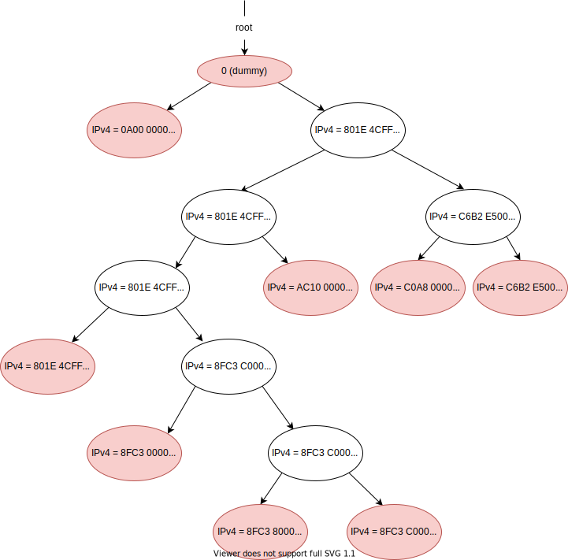

Lab 6 Writeup
=============

My name: Zhijing Hu

<del>My SUNet ID: [your sunetid here]</del>

<del>I collaborated with: [list sunetids here]</del>

<del>I would like to thank/reward these classmates for their help: [list sunetids here]</del>

This lab took me about 8 hours to do. <del>I [did/did not] attend the lab session.</del>

### Program Structure and Design of the Router:

The core of the router is its internal data structure to store and query the routing rules. 

The routing rule can be simply defined as a structure:

```c++
struct RouteRule {
    const uint32_t route_prefix_;
    const uint8_t prefix_length_;
    const std::optional<Address> next_hop_;
    const size_t interface_num_;
    // Here I stripped the constructor
};
```


In this project I choose **Radix Tree** to achieve the optimal time complexity and space complexity both. 

So here I will briefly reiterate the tasks and its basic solutions:

1. `void add_rule()`: For this function, we just call `insert()` to insert a routing rule into the radix tree.
2. `void route_one_datagram(InternetDatagram &dgram)`: For this function, we first check the TTL in `dgram`, if it's 0, return immediately; else decrease the TTL, check again and return immediately if it's 0. Then using longest-prefix-match to find the best interface to forward the `dgram` by using the `[]` to access the interface in the radix tree.


### Implementation Challenges:
The biggest challenge is **the implementation of radix tree**. 

Its node structure is:

```c++
template <typename Key, typename Value>
struct TrieNode {
    Key key_;          // the key. Here key is a IPv4 address, namely `uint32_t`
    Value *val_;       // the pointer to its value. Here value is a `struct RouteRule`
    int length_;       // the length should be prefix-matched in this node
    struct TrieNode *left = nullptr;
    struct TrieNode *right = nullptr;
    // Here I stripped the constructors
};
```

The **Radix Tree** definition is:

*(I use the name `Trie` because initially I implemented it as `Trie`.)*

```c++
//! A simplified Radix Tree data structure which ONLY supports INSERT and QUERY
TRIE_TEMPLATE_ARGUMENTS
class Trie {
  private:
    TrieNode<Key, Value> *root_{nullptr};

    void insert_helper(const Key &key, const Value &val, const int &len);

    // destructor helper function
    void rec_del(TrieNode<Key, Value> *root);

  public:
    Trie() : root_{nullptr} {}
    ~Trie() { rec_del(root_); }
    DISALLOW_COPY(Trie)

    //! Insert the routing rule.
    // `key` is a IPv4 address. `val` is a RouteRule struct
    // `len` is the number of most significant bits of the route prefix should be matched
    void insert(const Key &key, const Value &value, const int &len);

    //! access the longest-prefix match for a given key
    //! return nullptr if no matched key found
    Value *operator[](const Key &key);
};
```

#### Test And Debug the Radix Tree

**If you want to run the debugging version of my code, please switch to the branch `test`:**

```bash
$ git switch test
```


I added a test file, [`trie.cc`](./tests/trie.cc) in `./tests` to monitor its execution process.

The routing rules in `check_lab6` can be represented as follows in radix tree: 

*(IPv4 address represented as hex. The read oval means that the node has a `RouteRule`)*



If you have further interest in radix tree, please Google it!

### Remaining Bugs:
None.

- Optional: I had unexpected difficulty with: [describe]

- Optional: I think you could make this lab better by: [describe]

- Optional: I was surprised by: [describe]

- Optional: I'm not sure about: [describe]
